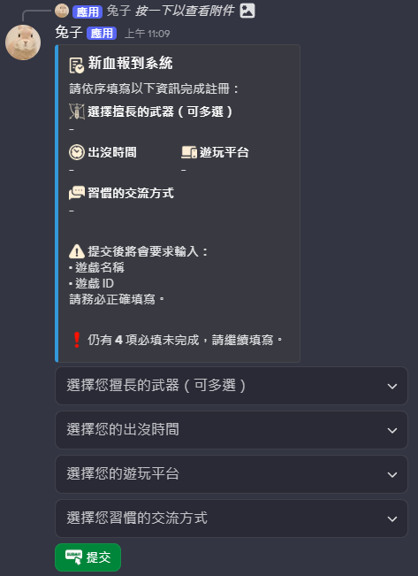

# 🎮 暮噤蟬鳴 TWCBot 使用指南

  專為魔物獵人設計的群組和Discord Bot，讓獵人交流與組隊更方便

---

## 🌟 功能總覽

## 新血報到

### 📝 開始新血報到
- 就在新血報到頻道的按鈕
- 只要點幾個按鍵登記遊戲名稱、遊戲 ID 與上線時段
- 不強迫改伺服器暱稱、不強迫蒐集個人隱私
- 組隊同樂不再需要自報ID和暱稱，輕鬆組隊

---

### 💳 建立專屬獵人名片
- 就在新血報到頻道的按鈕
- 給大家一個認識自己的機會
 

### 👥 獵友招募系統

- 建立組隊招募，設定條件與隊伍類型  
- 支援公開大廳、社群大廳、自訂大廳  
- 讓隊友快速加入你的狩獵

---

### 👑 大小金系統

- **持有金冠管理**：紀錄你的金冠任務與剩餘次數  
- **需求金冠登記**：讓系統為你尋找持有者  
- **公開展示**：讓其他獵人查看你的持有/需求

---

### 🎯 大小金開團

- 使用持有的金冠建立限時隊伍  
- 一鍵招募其他獵人加入金冠任務

---

### 🔍 大小金自動配對

- 自動為「需求金冠玩家」尋找「持有該金冠的玩家」  
- 對等交換自動判定  
- 最多顯示 3 位可交換對象，避免洗頻

---

## 🚀 如何開始？

1. 使用 `/新血報到` 完成註冊  
2. 前往各功能頻道查看可用功能  
3. 按照需求使用「招募」、「大小金管理」、「開團」等功能按鈕  

---

## 📚 使用指南

- ➤ [快速開始](getting-started.md)  
- ➤ [新血報到系統](features/registration.md)  
- ➤ [獵友招募系統](features/team-recruitment.md)  
- ➤ [大小金系統](features/crown-system.md)  
- ➤ [大小金開團](features/crown-team.md)  
- ➤ [自動配對](features/crown-matching.md)  

---

## 💡 小提醒

- 所有功能都需先完成註冊  
- 遊戲 ID 僅支援英數字，會自動轉大寫  
- 伺服器招募在 Bot 重啟後會清除  
- 大小金需求超過 7 天會自動移除  

---

## ❓ 有問題嗎？

- 查看 [常見問題](faq.md)  
- 聯絡 [技術支援](support.md)
